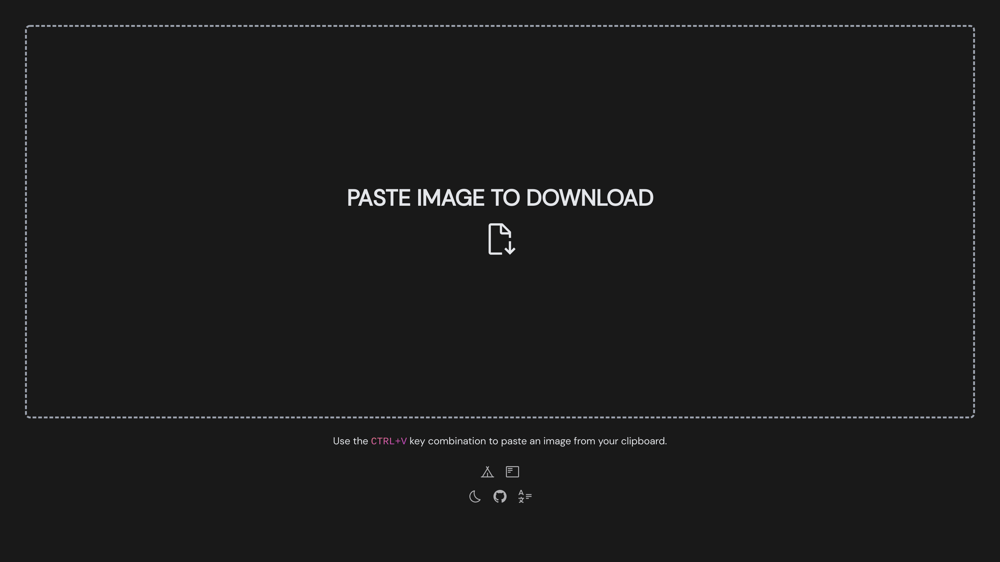

<p align='center'>
  
</p>

<h1 align='center'>
Paste Image to Download
</h1>

[Paste Image to Download](https://paste.photos/) is a utility website made by [Alejandro Akbal](https://akbal.dev)
for downloading images in your clipboard.

This tool was made for those moments where you take a screenshot and it is directly copied to the clipboard. \
Instead of going to MS Paint, pasting the image, choosing a location and saving it... \
**You can just paste it in this website.**



## Usage

### Development

Just run and visit http://localhost:3333

```bash
pnpm dev
```

### Build

To build the App, run

```bash
pnpm build
```

And you will see the generated file in `dist` that ready to be served.
